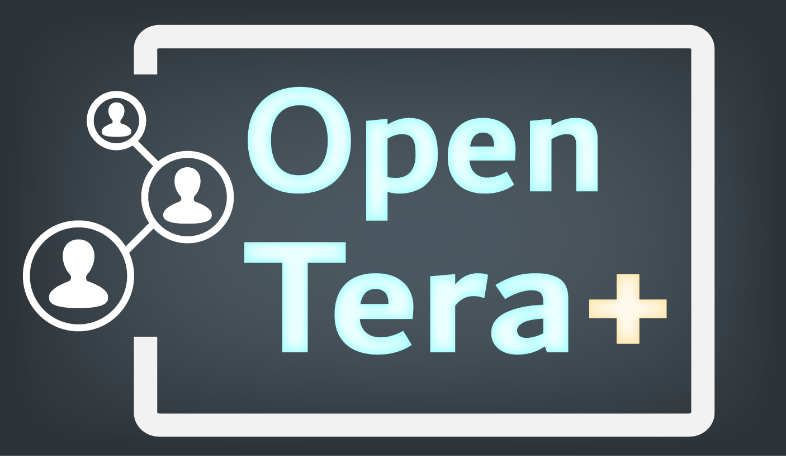
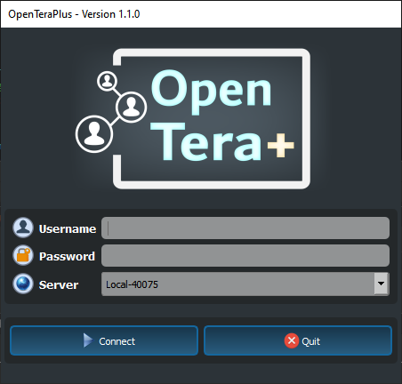
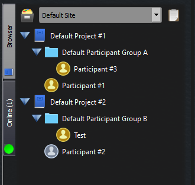
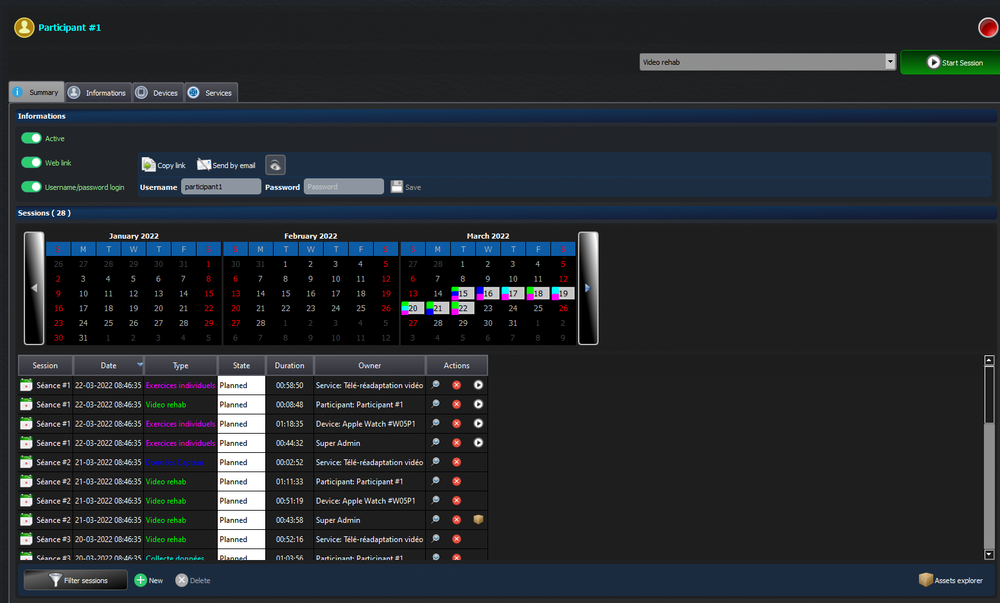
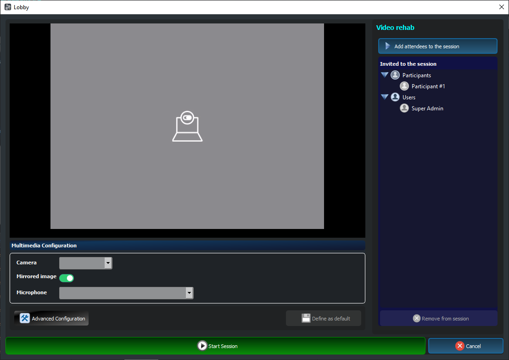
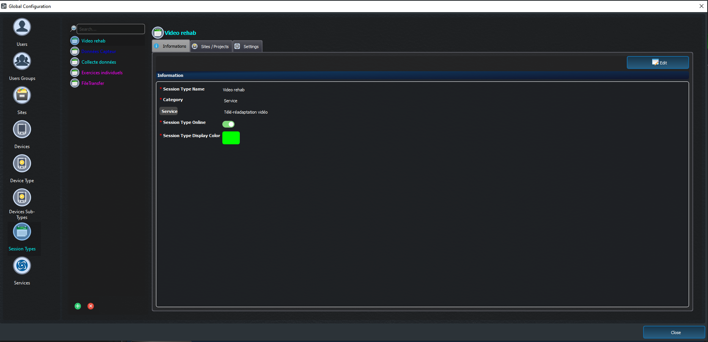

# OpenTeraPlus
OpenTeraPlus est un client pour le [Serveur OpenTera](https://github.com/introlab/opentera). Son rôle est d'agir comme un outil général pour gérer une instance d'OpenTera et de fournir certaines fonctionnalités spécifiques à certains services, telles que la Téléréadaptation.

## Auteurs

* Simon Brière, ing. M.Sc.A., Centre de recherche sur le Vieillissement (CDRV), CIUSSS de l'Estrie-CHUS (@sbriere)
* Dominic Létourneau, ing. M.Sc.A., IntRoLab, Université de Sherbrooke (@doumdi)
* François Michaud, ing. Ph.D., IntRoLab, Université de Sherbrooke
* Michel Tousignant, pht, Ph.D., CDRV, Université de Sherbrooke

## Publication(s)

* Panchea, A.M., Létourneau, D., Brière, S. et al., [OpenTera: A microservice architecture solution for rapid prototyping of robotic solutions to COVID-19 challenges in care facilities](https://rdcu.be/cHzmf),  Health Technol. 12, 583–596 (2022)

## Fonctionnalités actuelles

### Aperçu des fonctionnalités
* Gestion globale du système, incluant les accès utilisateurs - rôles pour sites, projets, appareils, types de séances et services
* Gestion des participants (patients), incluant l'activation/désactivation, regroupements et tableaux de bord des séances
* Intégration spécifique pour les services de téléréadaptation et toutes les activités cliniques demandant une séance audio-vidéo adaptée au contexte
* Gestion des séances, incluant fichiers / données attachées et tests / questionnaires

### Fonctionnalités détaillées
* Connexion en tant qu'utilisateur
  * Implémentation de l'accès selon les groupes utilisateurs
* Gestion des projets et sites
  * Accès des groupes utilisateurs
  * Appareils, types de séances et évaluations liées
  * Services associés
* Gestion des participants (patients)
  * Regroupement des participants
  * Activation / désactivation des participants, liens webs et connexion traditionnelle
  * Ajout / suppression
* Gestion des séances
  * Création de nouvelle séance et édition de séances existantes
  * Vue calendrier des séances réalisées et planifiées
  * Affichage des événements de séance
  * Téléchargement et gestion des fichiers attachés aux séances
  * Affichage des évaluations attachées aux séances
* Gestion des appareils
  * Association d'appareils aux participants
  * Activation / désactivation d'appareils
  * Configuration des appareils
* Gestion des services OpenTera
  * Édition de la configuration
* Séances de téléréadaptation
  * Création et gestion de séances vidéos axées sur la télésanté
* ... et plus!

# Captures d'écran
<table><tr>
<td></td>
<td></td>
<td></td>
<td></td>
<td></td>
</tr></table>

# Vidéo

 
# Licence
OpenTeraPlus est licencé sous [GNU General Public License v3.0](https://www.gnu.org/licenses/gpl-3.0.en.html)
